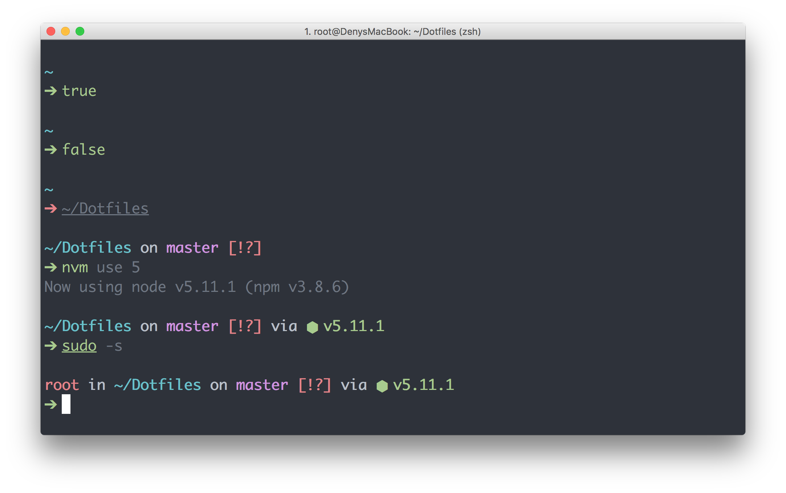

# ⭐🚀 Spaceship ZSH

> An [“Oh My ZSH!”](http://ohmyz.sh/) theme for Astronauts.

Spaceship is an [“Oh My ZSH!”](http://ohmyz.sh/) minimalistic and powerful theme. It combines everything you may need for convenient work, without unnecessary complications, like a real spaceship.

Currently it shows:

* Current git branch.
* Git repo status:
  * `+` — uncommitted changes in the index;
  * `!` — unstaged changes;
  * `?` — untracked changes;
  * `$` — stashed changes;
  * `⇣` — unpulled commits;
  * `⇡` — unpushed commits.
* Prompt character turns red if the last command exits with non-zero code.
* Hostname only displayed when in an SSH session.
* Username displayed only when it isn't `$LOGNAME`.
* Username turns red when root.
* Current Node.js version, through NVM (`⬢`).
* Current Ruby version, through RVM/RBENV/CHRUBY (`💎`).
* Current Python virtualenv.

Want more features? Please, [open an issue](https://github.com/denysdovhan/spaceship-zsh-theme/issues/new) or send pull request.

## Requirements

For correct work you will first need:

* A [`zsh`](http://www.zsh.org/) must be installed
* A zsh–framework like [oh-my-zsh](http://ohmyz.sh/), [antigen](http://antigen.sharats.me/) or [zgen](https://github.com/tarjoilija/zgen)

## Installing

### For oh-my-zsh users

Installing using **curl**:

```
curl -o - https://raw.githubusercontent.com/denysdovhan/spaceship-zsh-theme/master/install.sh | zsh
```

Installing using **wget**:

```
wget -O - https://raw.githubusercontent.com/denysdovhan/spaceship-zsh-theme/master/install.sh | zsh
```

If you have problems, follow these instructions:

1. Download the theme [here](https://raw.githubusercontent.com/denysdovhan/spaceship-zsh-theme/master/spaceship.zsh)
2. Rename `spaceship.zsh` to `spaceship.zsh-theme`
3. Put the file `spaceship.zsh-theme` in `$ZSH_CUSTOM/themes/`
4. Add the line to your `~/.zshrc`:
  ```
  ZSH_THEME="spaceship"
  ```

### For antigen users

Add the following snippet `~/.zshrc` after the line `antigen use oh-my-zsh`:

```
antigen theme https://github.com/denysdovhan/spaceship-zsh-theme spaceship
```

### For Zgen users

Add the following line to your `~/.zshrc` where you're adding your other zsh plugins:

```
zgen load denysdovhan/spaceship-zsh-theme spaceship
```

## Screenshots

The spaceship theme looks awesome with some popular color schemes. Take a look to make sure:

### Monokai


### Solarized Dark


### Night Eighties


### One Dark


## Options

Now you have ability to disable elements of Spaceship. All options must be overridden in your `.zshrc` file.

### Prompt

| Variable | Default | Meaning |
| :------- | :-----: | ------- |
| `SPACESHIP_PROMPT_SYMBOL` | `➔` | Character to be shown before any command |
| `SPACESHIP_PROMPT_SEPARATE_LINE` | `true` | Make the prompt span across two lines |
| `SPACESHIP_PROMPT_ADD_NEWLINE` | `true` | Adds a newline character before each prompt line |
| `SPACESHIP_PROMPT_TRUNC` | `3` | Number of folders of cwd to show in prompt, 0 to show all |

### Git

| Variable | Default | Meaning |
| :------- | :-----: | ------- |
| `SPACESHIP_GIT_SHOW` | `true` | Show/hide git status |
| `SPACESHIP_GIT_UNCOMMITTED` | `+` | Character to be shown on uncommitted changes |
| `SPACESHIP_GIT_UNSTAGED` | `!` | Character to be shown on unstaged changes |
| `SPACESHIP_GIT_UNTRACKED` | `?` | Character to be shown on untracked changes |
| `SPACESHIP_GIT_STASHED` | `$` | Character to be shown on stashed changes |
| `SPACESHIP_GIT_UNPULLED` | `⇣` | Character to be shown on unpulled changes |
| `SPACESHIP_GIT_UNPUSHED` | `⇡` | Character to be shown on unpushed changes |

### Nvm

| Variable | Default | Meaning |
| :------- | :-----: | ------- |
| `SPACESHIP_NVM_SHOW` | `true` | Current Node.js version |
| `SPACESHIP_NVM_SYMBOL` | `⬢` | Character to be shown before Node.js version |

### Ruby

| Variable | Default | Meaning |
| :------- | :-----: | ------- |
| `SPACESHIP_RUBY_SHOW` | `true` | Current Ruby version |
| `SPACESHIP_RUBY_SYMBOL` | `💎` | Character to be shown before Ruby version |

### Venv

| Variable | Default | Meaning |
| :------- | :-----: | ------- |
| `SPACESHIP_VENV_SHOW` | `true` | Current Python virtualenv |

### Example

Here is all optins which may be changed. Copy this to your `~/.zshrc` to make it easy to change.

```zsh
# PROMPT
SPACESHIP_PROMPT_SYMBOL='➔'
SPACESHIP_PROMPT_ADD_NEWLINE=true
SPACESHIP_PROMPT_SEPARATE_LINE=true

# GIT
SPACESHIP_GIT_SHOW=true
SPACESHIP_GIT_UNCOMMITTED='+'
SPACESHIP_GIT_UNSTAGED='!'
SPACESHIP_GIT_UNTRACKED='?'
SPACESHIP_GIT_STASHED='$'
SPACESHIP_GIT_UNPULLED='⇣'
SPACESHIP_GIT_UNPUSHED='⇡'

# NVM
SPACESHIP_NVM_SHOW=true
SPACESHIP_NVM_SYMBOL='⬢'

# RUBY
SPACESHIP_RUBY_SHOW=true
SPACESHIP_RUBY_SYMBOL='💎'

# VENV
SPACESHIP_VENV_SHOW=true
```

## License

MIT © [Denys Dovhan](http://denysdovhan.com)
