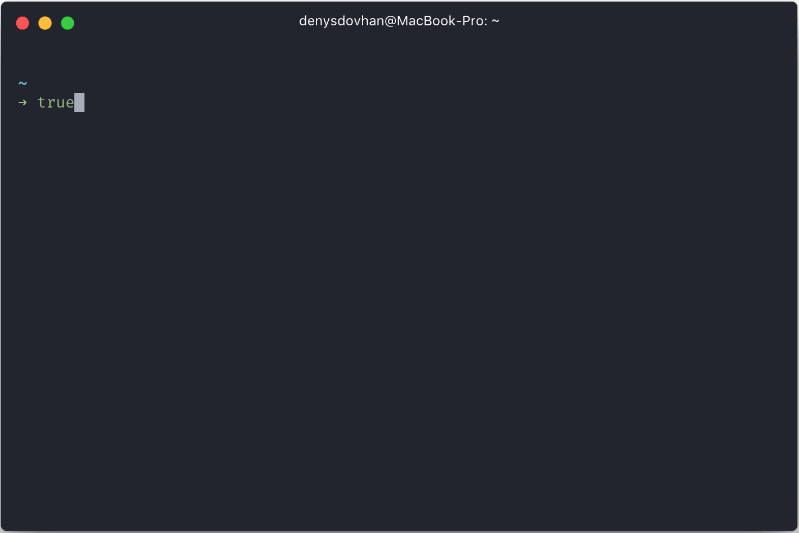

<p align="center">
  <a href="https://github.com/denysdovhan/spaceship-zsh-theme">
    
  </a>
</p>

# ⭐🚀 Spaceship ZSH

[![NPM version][npm-image]][npm-url]
[![ZSH][zsh-image]][zsh-url]
[![Oh-My-Zsh][omz-image]][omz-url]
[![Donatation][donate-image]][donate-url]

> An [“Oh My ZSH!”][oh-my-zsh] theme for Astronauts.

Spaceship is a minimalistic, powerful and extremely customizable [“Oh My ZSH!”][oh-my-zsh] theme. It combines everything you may need for convenient work, without unnecessary complications, like a real spaceship.

Currently it shows:

* Current git branch.
* Git repo status:
  * `?` — untracked changes;
  * `+` — uncommitted changes in the index;
  * `!` — unstaged changes;
  * `»` — renamed files;
  * `✘` — deleted files;
  * `$` — stashed changes;
  * `=` — unmerged changes;
  * `⇡` — ahead of remote branch;
  * `⇣` — behind of remote branch;
  * `⇕` — diverged chages.
* Mercurial repo status:
  * `?` — untracked changes;
  * `+` — uncommitted changes in the index;
  * `!` — unstaged changes;
  * `✘` — deleted files;
* Prompt character turns red if the last command exits with non-zero code.
* Hostname only displayed when in an SSH session.
* Username displayed only when it isn't `$LOGNAME`.
* Username turns red when root.
* If repo is a package, shows its version through npm (`📦`).
* Current Node.js version, through nvm/nodenv/n (`⬢`).
* Current Ruby version, through rvm/rbenv/chruby (`💎`).
* Current Elixir version, through kiex/exenv/elixir (`💧`).
* Current Swift version, through swiftenv (`🐦`).
* Current Xcode version, through xenv (`🛠`).
* Current Go version (`🐹`).
* Current PHP version (`🐘`).
* Current Rust version (`𝗥`)
* Current version of Haskell Tool Stack (`λ`)
* Current Julia version (`ஃ`)
* Current Docker version and connected machine (`🐳`).
* Current Amazon Web Services (AWS) profile (`☁️`) ([Using named profiles](http://docs.aws.amazon.com/cli/latest/userguide/cli-multiple-profiles.html))
* Current Python virtualenv.
* Current Python pyenv (`🐍`).
* Current .NET SDK version, through dotnet-cli (`.NET`).
* Current Ember.js version, through ember-cli (`🐹`).
* Current Vi-mode mode ([with handy aliases for temporarily enabling](#vi-mode-vi_mode)).
* Indicator for jobs in the background (`✦`).
* Optional exit-code of last command ([how to enable](#exit-code-exit_code)).
* Optional time stamps 12/24hr in format ([how to enable](#time-time)).
* Execution time of the last command if it exceeds the set threshold.

Want more features? Please, [open an issue](https://github.com/denysdovhan/spaceship-zsh-theme/issues/new) or send pull request.

## Preview

<p align="center">
  
</p>

You can find more examples with different color schemes in [Screenshots](https://github.com/denysdovhan/spaceship-zsh-theme/wiki/Screenshots) wiki-page.

## Requirements

For correct work you will first need:

* A [`zsh`](http://www.zsh.org/) (v5.0.5 or recent) must be installed
* A zsh–framework like [oh-my-zsh], [antigen] or [zgen]

## Installing

### [npm]

```
npm install -g spaceship-zsh-theme
```

Done. This command should link `spaceship.zsh-theme` to your `$ZSH_CUSTOM/themes` and set `$ZSH_CUSTOM` to `"spaceship"`. Just reload your terminal.

**Tip:** Update Spaceship to new versions as any other package.

### [oh-my-zsh]

Installing using **curl**:

```zsh
curl -o - https://raw.githubusercontent.com/denysdovhan/spaceship-zsh-theme/master/install.zsh | zsh
```

Installing using **wget**:

```zsh
wget -O - https://raw.githubusercontent.com/denysdovhan/spaceship-zsh-theme/master/install.zsh | zsh
```

### [antigen]

Add the following snippet `~/.zshrc` after the line `antigen use oh-my-zsh`:

```
antigen theme https://github.com/denysdovhan/spaceship-zsh-theme spaceship
```

### [antibody]

Update your `.zshrc` file with the following line:

```
antibody bundle denysdovhan/spaceship-zsh-theme
```

### [zgen]

Add the following line to your `~/.zshrc` where you're adding your other zsh plugins:

```
zgen load denysdovhan/spaceship-zsh-theme spaceship
```

### [zplug]

Use this command in your `.zshrc` to load Spaceship as prompt theme:

```
zplug denysdovhan/spaceship-zsh-theme, use:spaceship.zsh, from:github, as:theme
```

### Manual

If you have problems with approches above, follow these instructions:

1. Download the theme [here](https://raw.githubusercontent.com/denysdovhan/spaceship-zsh-theme/master/spaceship.zsh)
2. Rename `spaceship.zsh` to `spaceship.zsh-theme`
3. Put the file `spaceship.zsh-theme` in `$ZSH_CUSTOM/themes/`
4. Add the line to your `~/.zshrc`: `ZSH_THEME="spaceship"`

## Options

Now you have ability to disable elements of Spaceship. All options must be overridden in your `.zshrc` file.

Take a look at popular option presets or share your own configuration in [Presets](https://github.com/denysdovhan/spaceship-zsh-theme/wiki/Presets) wiki page.

### Order

You can specify the order of prompt section using `SPACESHIP_PROMPT_ORDER` option. Use zsh array syntax to define your own prompt order. The default order is:

```zsh
SPACESHIP_PROMPT_ORDER=(
  time          # Time stampts section
  user          # Username section
  host          # Hostname section
  dir           # Current directory section
  git           # Git section (git_branch + git_status)
  hg            # Mercurial section (hg_branch  + hg_status)
  package       # Package version
  node          # Node.js section
  ruby          # Ruby section
  elixir        # Elixir section
  xcode         # Xcode section
  swift         # Swift section
  golang        # Go section
  php           # PHP section
  rust          # Rust section
  haskell       # Haskell Stack section
  julia         # Julia section
  docker        # Docker section
  aws           # Amazon Web Services section
  venv          # virtualenv section
  pyenv         # Pyenv section
  dotnet        # .NET section
  ember         # Ember.js section
  exec_time     # Execution time
  line_sep      # Line break
  vi_mode       # Vi-mode indicator
  jobs          # Backgound jobs indicator
  exit_code     # Exit code section
  char          # Prompt character
)
```

### Prompt

| Variable | Default | Meaning |
| :------- | :-----: | ------- |
| `SPACESHIP_PROMPT_SYMBOL` | `➜` | Character to be shown before any command |
| `SPACESHIP_PROMPT_ADD_NEWLINE` | `true` | Adds a newline character before each prompt line |
| `SPACESHIP_PROMPT_SEPARATE_LINE` | `true` | Make the prompt span across two lines |
| `SPACESHIP_PROMPT_PREFIXES_SHOW` | `true` | Show prefixes before prompt sections or not |
| `SPACESHIP_PROMPT_SUFFIXES_SHOW` | `true` | Show suffixes before prompt sections or not |
| `SPACESHIP_PROMPT_DEFAULT_PREFIX` | `via ` | Default prefix for prompt sections |
| `SPACESHIP_PROMPT_DEFAULT_SUFFIX` | ` ` | Default suffix for prompt section |

### Time (`time`)

Disabled as default. Set `SPACESHIP_TIME_SHOW` to `true` in your `.zshrc`, if you need to show time stamps.

| Variable | Default | Meaning |
| :------- | :-----: | ------- |
| `SPACESHIP_TIME_SHOW` | `false` | Show time (set to `true` for enabling) |
| `SPACESHIP_TIME_PREFIX` | `at ` | Prefix before time section |
| `SPACESHIP_TIME_SUFFIX` | `$SPACESHIP_PROMPT_DEFAULT_SUFFIX` | Suffix after time section |
| `SPACESHIP_TIME_COLOR` | `yellow` | Color of time section |
| `SPACESHIP_TIME_FORMAT` | `false` | Custom date formatting (e.g. `%D{%a %R}`) [ZSH date formats](http://zsh.sourceforge.net/Doc/Release/Prompt-Expansion.html#Date-and-time) |
| `SPACESHIP_TIME_12HR` | `false` | Format time using 12-hour clock (am/pm) |

### Username (`user`)

Username is shown only when it's not the same as `$LOGNAME`, when you're connected via SSH or when you're root. Root user is highlighted in `SPACESHIP_USER_COLOR_ROOT` color (red as default).

| Variable | Default | Meaning |
| :------- | :-----: | ------- |
| `SPACESHIP_USER_SHOW` | `true` | Show user section |
| `SPACESHIP_USER_PREFIX` | `with ` | Prefix before user section |
| `SPACESHIP_USER_SUFFIX` | `$SPACESHIP_PROMPT_DEFAULT_SUFFIX` | Suffix after user section |
| `SPACESHIP_USER_COLOR` | `yellow` | Color of user section |
| `SPACESHIP_USER_COLOR_ROOT` | `red` | Color of user section when it's root |

### Hostname (`host`)

Hostname is shown only when you're connected via SSH.

| Variable | Default | Meaning |
| :------- | :-----: | ------- |
| `SPACESHIP_HOST_SHOW` | `true` | Show host section |
| `SPACESHIP_HOST_PREFIX` | `at ` | Prefix before the connected SSH machine name |
| `SPACESHIP_HOST_SUFFIX` | `$SPACESHIP_PROMPT_DEFAULT_SUFFIX` | Suffix after the connected SSH machine name |
| `SPACESHIP_HOST_COLOR` | `green` | Color of host section |

### Directory (`dir`)

Directory is always shown and truncated to the value of `SPACESHIP_DIR_TRUNC`.

| Variable | Default | Meaning |
| :------- | :-----: | ------- |
| `SPACESHIP_DIR_SHOW` | `true` | Show directory section |
| `SPACESHIP_DIR_PREFIX` | `in ` | Prefix before current directory |
| `SPACESHIP_DIR_SUFFIX` | `$SPACESHIP_PROMPT_DEFAULT_SUFFIX` | Suffix after current directory |
| `SPACESHIP_DIR_TRUNC` | `3` | Number of folders of cwd to show in prompt, 0 to show all |
| `SPACESHIP_DIR_COLOR` | `cyan` | Color of directory section |

### Git (`git`)

Git section is consists with `git_branch` and `git_status` subsections. It is shown only in Git repositories.

| Variable | Default | Meaning |
| :------- | :-----: | ------- |
| `SPACESHIP_GIT_SHOW` | `true` | Show Git section |
| `SPACESHIP_GIT_PREFIX` | `on ` | Prefix before Git section |
| `SPACESHIP_GIT_SUFFIX` | `$SPACESHIP_PROMPT_DEFAULT_SUFFIX` | Suffix after Git section |
| `SPACESHIP_GIT_SYMBOL` | ` ` | Character to be shown before Git section (requires [powerline patched font][powerline]) |

#### Git branch (`git_branch`)

| Variable | Default | Meaning |
| :------- | :-----: | ------- |
| `SPACESHIP_GIT_BRANCH_SHOW` | `true` | Show Git branch subsection |
| `SPACESHIP_GIT_BRANCH_PREFIX` | `$SPACESHIP_GIT_SYMBOL` | Prefix before Git branch subsection |
| `SPACESHIP_GIT_BRANCH_SUFFIX` | `` | Suffix after Git branch subsection |
| `SPACESHIP_GIT_BRANCH_COLOR` | `magenta` | Color of Git branch subsection |

#### Git status (`git_status`)

Git status indicators is shown only when you have dirty repository.

| Variable | Default | Meaning |
| :------- | :-----: | ------- |
| `SPACESHIP_GIT_STATUS_SHOW` | `true` | Show Git status subsection |
| `SPACESHIP_GIT_STATUS_PREFIX` | ` [` | Prefix before Git status subsection |
| `SPACESHIP_GIT_STATUS_SUFFIX` | `]` | Suffix after Git status subsection |
| `SPACESHIP_GIT_STATUS_COLOR` | `red` | Color of Git status subsection |
| `SPACESHIP_GIT_STATUS_UNTRACKED` | `?` | Indicator for untracked changes |
| `SPACESHIP_GIT_STATUS_ADDED` | `+` | Indicator for added changes |
| `SPACESHIP_GIT_STATUS_MODIFIED` | `!` | Indicator for unstaged files |
| `SPACESHIP_GIT_STATUS_RENAMED` | `»` | Indicator for renamed files |
| `SPACESHIP_GIT_STATUS_DELETED` | `✘` | Indicator for deleted files |
| `SPACESHIP_GIT_STATUS_STASHED` | `$` | Indicator for stashed changes |
| `SPACESHIP_GIT_STATUS_UNMERGED` | `=` | Indicator for unmerged changes |
| `SPACESHIP_GIT_STATUS_AHEAD` | `⇡` | Indicator for unpushed changes (ahead of remote branch) |
| `SPACESHIP_GIT_STATUS_BEHIND` | `⇣` | Indicator for unpulled changes (behind of remote branch) |
| `SPACESHIP_GIT_STATUS_DIVERGED` | `⇕` | Indicator for diverged chages (diverged with remote branch) |

### Mercurial (`hg`)

Mercurial section is consists with `hg_branch` and `hg_status` subsections. It is shown only in Mercurial repositories.

| Variable | Default | Meaning |
| :------- | :-----: | ------- |
| `SPACESHIP_HG_SHOW` | `true` | Show Mercurial section |
| `SPACESHIP_HG_PREFIX` | `on ` | Prefix before Mercurial section |
| `SPACESHIP_HG_SUFFIX` | `$SPACESHIP_PROMPT_DEFAULT_SUFFIX` | Suffix after Mercurial section |
| `SPACESHIP_HG_SYMBOL` | `☿ ` | Character to be shown before Mercurial section |

#### Mercurial branch (`hg_branch`)

| Variable | Default | Meaning |
| :------- | :-----: | ------- |
| `SPACESHIP_HG_BRANCH_SHOW` | `true` | Show Mercurial branch subsection |
| `SPACESHIP_HG_BRANCH_PREFIX` | `$SPACESHIP_HG_SYMBOL` | Prefix before Mercurial branch subsection |
| `SPACESHIP_HG_BRANCH_SUFFIX` | `$SPACESHIP_PROMPT_DEFAULT_SUFFIX` | Suffix after Mercurial branch subsection |
| `SPACESHIP_HG_BRANCH_COLOR` | `magenta` | Color of Mercurial branch subsection |

#### Mercurial status (`hg_status`)

Mercurial status indicators is shown only when you have dirty repository.

| Variable | Default | Meaning |
| :------- | :-----: | ------- |
| `SPACESHIP_HG_STATUS_SHOW` | `true` | Show Mercurial status subsection |
| `SPACESHIP_HG_STATUS_PREFIX` | `[` | Prefix before Mercurial status subsection |
| `SPACESHIP_HG_STATUS_SUFFIX` | `]` | Suffix after Mercurial status subsection |
| `SPACESHIP_HG_STATUS_COLOR` | `red` | Color of Mercurial status subsection |
| `SPACESHIP_HG_STATUS_UNTRACKED` | `?` | Indicator for untracked changes |
| `SPACESHIP_HG_STATUS_ADDED` | `+` | Indicator for added changes |
| `SPACESHIP_HG_STATUS_MODIFIED` | `!` | Indicator for unstaged files |
| `SPACESHIP_HG_STATUS_DELETED` | `✘` | Indicator for deleted files |

### Package version (`package`)

> Works only for npm at the moment. Please, help us improve this section!

Package version is shown when repository is a package (contains a `package.json` file). This is the version of the package you are working on, not the version of package manager itself.

| Variable | Default | Meaning |
| :------- | :-----: | ------- |
| `SPACESHIP_PACKAGE_SHOW` | `true` | Show package version |
| `SPACESHIP_PACKAGE_PREFIX` | `is ` | Prefix before package version section |
| `SPACESHIP_PACKAGE_SUFFIX` | `$SPACESHIP_PROMPT_DEFAULT_SUFFIX` | Suffix after package version section |
| `SPACESHIP_PACKAGE_SYMBOL` | `📦 ` | Character to be shown before package version |
| `SPACESHIP_PACKAGE_COLOR` | `red` | Color of package version section |

### Node.js (`node`)

Node.js section is shown only in directories that contain `package.json` file, or `node_modules` folder, or any other file with `.js` extension.

If you use [n] as Node.js version manager, please, set `SPACESHIP_NODE_DEFAULT_VERSION` to the default Node.js version. If current version is the same as `SPACESHIP_NODE_DEFAULT_VERSION`, then Node.js section will be hidden.

| Variable | Default | Meaning |
| :------- | :-----: | ------- |
| `SPACESHIP_NODE_SHOW` | `true` | Current Node.js section |
| `SPACESHIP_NODE_PREFIX` | `$SPACESHIP_PROMPT_DEFAULT_PREFIX` | Prefix before Node.js section |
| `SPACESHIP_NODE_SUFFIX` | `$SPACESHIP_PROMPT_DEFAULT_SUFFIX` | Suffix after Node.js section |
| `SPACESHIP_NODE_SYMBOL` | `⬢ ` | Character to be shown before Node.js version |
| `SPACESHIP_NODE_DEFAULT_VERSION` | `` | Node.js version to be treated as default (for [n] support) |
| `SPACESHIP_NODE_COLOR` | `green` | Color of Node.js section |

### Ruby (`ruby`)

Ruby section is shown only in directories that contain `Gemfile`, or `Rakefile`, or any other file with `.rb` extension.

| Variable | Default | Meaning |
| :------- | :-----: | ------- |
| `SPACESHIP_RUBY_SHOW` | `true` | Show Ruby section |
| `SPACESHIP_RUBY_PREFIX` | `$SPACESHIP_PROMPT_DEFAULT_PREFIX` | Prefix before Ruby section |
| `SPACESHIP_RUBY_SUFFIX` | `$SPACESHIP_PROMPT_DEFAULT_SUFFIX` | Suffix after Ruby section |
| `SPACESHIP_RUBY_SYMBOL` | `💎  ` | Character to be shown before Ruby version |
| `SPACESHIP_RUBY_COLOR` | `red` | Color of Ruby section |

### Elixir (`elixir`)

Elixir section is shown only in directories that contain `mix.exs`, or any other file with `.ex` or `.exs` extension. If the current elixir version is the same as the version set in `SPACESHIP_ELIXIR_DEFAULT_VERSION`, the elixir section will be hidden.

| Variable | Default | Meaning |
| :------- | :-----: | ------- |
| `SPACESHIP_ELIXIR_SHOW` | `true` | Show Elixir section |
| `SPACESHIP_ELIXIR_PREFIX` | `$SPACESHIP_PROMPT_DEFAULT_PREFIX` | Prefix before Elixir section |
| `SPACESHIP_ELIXIR_SUFFIX` | `$SPACESHIP_PROMPT_DEFAULT_SUFFIX` | Suffix after Elixir section |
| `SPACESHIP_ELIXIR_DEFAULT_VERSION` | `` | Elixir version to be treated as default |
| `SPACESHIP_ELIXIR_SYMBOL` | `💧  ` | Character to be shown before Elixir version |
| `SPACESHIP_ELIXIR_COLOR` | `magenta` | Color of Elixir section |

### Xcode (`xcode`)

Shows current version of Xcode. Local version has more priority than global.

| Variable | Default | Meaning |
| :------- | :-----: | ------- |
| `SPACESHIP_XCODE_SHOW_LOCAL` | `true` | Current local Xcode version based on [xcenv] |
| `SPACESHIP_XCODE_SHOW_GLOBAL` | `true` | Global Xcode version based on [xcenv] |
| `SPACESHIP_XCODE_PREFIX` | `$SPACESHIP_PROMPT_DEFAULT_PREFIX` | Prefix before Xcode section |
| `SPACESHIP_XCODE_SUFFIX` | `$SPACESHIP_PROMPT_DEFAULT_SUFFIX` | Suffix after Xcode section |
| `SPACESHIP_XCODE_SYMBOL` | `🛠 ` | Character to be shown before Xcode version |
| `SPACESHIP_XCODE_COLOR` | `blue` | Color of Xcode section |

### Swift (`swift`)

Shows current version of Swift. Local version has more priority than global.

| Variable | Default | Meaning |
| :------- | :-----: | ------- |
| `SPACESHIP_SWIFT_SHOW_LOCAL` | `true` | Current local Swift version based on [swiftenv] |
| `SPACESHIP_SWIFT_SHOW_GLOBAL` | `false` | Global Swift version based on [swiftenv] |
| `SPACESHIP_SWIFT_PREFIX` | `$SPACESHIP_PROMPT_DEFAULT_PREFIX` | Prefix before the Swift section |
| `SPACESHIP_SWIFT_SUFFIX` | `$SPACESHIP_PROMPT_DEFAULT_SUFFIX` | Suffix to be shown before the Swift section |
| `SPACESHIP_SWIFT_SYMBOL` | `🐦 ` | Character to be shown before Swift version |
| `SPACESHIP_SWIFT_COLOR` | `yellow` | Color of Swift section |

### Go (`golang`)

Go section is shown only in directories that contain `Godeps`, `glide.yaml`, any other file with `.go` extension, or when current directory is in the Go workspace defined in `$GOPATH`.

| Variable | Default | Meaning |
| :------- | :-----: | ------- |
| `SPACESHIP_GOLANG_SHOW` | `true` | Shown current Go version or not |
| `SPACESHIP_GOLANG_PREFIX` | `$SPACESHIP_PROMPT_DEFAULT_PREFIX` | Prefix before the Go section |
| `SPACESHIP_GOLANG_SUFFIX` | `$SPACESHIP_PROMPT_DEFAULT_SUFFIX` | Suffix after the Go section |
| `SPACESHIP_GOLANG_SYMBOL` | `🐹 ` | Character to be shown before Go version |
| `SPACESHIP_GOLANG_COLOR` | `cyan` | Color of Go section |

### PHP (`php`)

PHP section is shown only in directories that contain any file with `.php` extension.

| Variable | Default | Meaning |
| :------- | :-----: | ------- |
| `SPACESHIP_PHP_SHOW` | true | Show PHP section |
| `SPACESHIP_PHP_PREFIX` | `$SPACESHIP_PROMPT_DEFAULT_PREFIX` | Prefix before the PHP section |
| `SPACESHIP_PHP_SUFFIX` | `$SPACESHIP_PROMPT_DEFAULT_SUFFIX` | Suffix after the PHP section |
| `SPACESHIP_PHP_SYMBOL` | `🐘 ` | Character to be shown before PHP version |
| `SPACESHIP_PHP_COLOR` | `blue` | Color of PHP section |

### Rust (`rust`)

Rust section is shown only in directories that contain `Cargo.toml` or any other file with `.rs` extension.

| Variable | Default | Meaning |
| :------- | :-----: | ------- |
| `SPACESHIP_RUST_SHOW` | `true` | Shown current Rust version or not |
| `SPACESHIP_RUST_PREFIX` | `$SPACESHIP_PROMPT_DEFAULT_PREFIX` | Prefix before the Rust section |
| `SPACESHIP_RUST_SUFFIX` | `$SPACESHIP_PROMPT_DEFAULT_SUFFIX` | Suffix after the Rust section |
| `SPACESHIP_RUST_SYMBOL` | `𝗥 ` | Character to be shown before Rust version |
| `SPACESHIP_RUST_COLOR` | `red` | Color of Rust section |

### Haskell (`haskell`)

Haskell section is shown only in directories that contain `stack.yaml` file.

| Variable | Default | Meaning |
| :------- | :-----: | ------- |
| `SPACESHIP_HASKELL_SHOW` | `true` | Shown current Haskell Tool Stack version or not |
| `SPACESHIP_HASKELL_PREFIX` | `$SPACESHIP_PROMPT_DEFAULT_PREFIX` | Prefix before the Haskell section |
| `SPACESHIP_HASKELL_SUFFIX` | `$SPACESHIP_PROMPT_DEFAULT_SUFFIX` | Suffix after the Haskell section |
| `SPACESHIP_HASKELL_SYMBOL` | `λ ` | Character to be shown before Haskell Tool Stack version |
| `SPACESHIP_HASKELL_COLOR` | `red` | Color of Haskell section |

### Julia (`julia`)

Julia section is shown only in directories that contain file with `.jl` extension.

| Variable | Default | Meaning |
| :------- | :-----: | ------- |
| `SPACESHIP_JULIA_SHOW` | `true` | Shown current Julia version or not |
| `SPACESHIP_JULIA_PREFIX` | `$SPACESHIP_PROMPT_DEFAULT_PREFIX` | Prefix before the Julia section |
| `SPACESHIP_JULIA_SUFFIX` | `$SPACESHIP_PROMPT_DEFAULT_SUFFIX` | Suffix after the Julia section |
| `SPACESHIP_JULIA_SYMBOL` | `ஃ ` | Character to be shown before Julia version |
| `SPACESHIP_JULIA_COLOR` | `green` | Color of Julia section |

### Docker (`docker`)

Shows Docker version and current connected machine name.

| Variable | Default | Meaning |
| :------- | :-----: | ------- |
| `SPACESHIP_DOCKER_SHOW` | `true` | Show current Docker version and connected docker-machine or not |
| `SPACESHIP_DOCKER_PREFIX` | `on ` | Prefix before the Docker section |
| `SPACESHIP_DOCKER_SUFFIX` | `$SPACESHIP_PROMPT_DEFAULT_SUFFIX` | Suffix after the Docker section |
| `SPACESHIP_DOCKER_SYMBOL` | `🐳 ` | Character to be shown before Docker version |
| `SPACESHIP_DOCKER_COLOR` | `cyan` | Color of Docker section |

### Amazon Web Services (AWS) (`aws`)

Shows selected Amazon Web Services profile using '[named profiles](http://docs.aws.amazon.com/cli/latest/userguide/cli-multiple-profiles.html)'.

| Variable | Default | Meaning |
| :------- | :-----: | ------- |
| `SPACESHIP_AWS_SHOW` | `true` | Show current selected AWS-cli profile or not |
| `SPACESHIP_AWS_PREFIX` | `using ` | Prefix before the AWS section |
| `SPACESHIP_AWS_SUFFIX` | `$SPACESHIP_PROMPT_DEFAULT_SUFFIX` | Suffix after the AWS section |
| `SPACESHIP_AWS_SYMBOL` | `☁️ ` | Character to be shown before AWS profile |
| `SPACESHIP_AWS_COLOR` | `208` | Color of AWS section |

### Virtualenv (`venv`)

| Variable | Default | Meaning |
| :------- | :-----: | ------- |
| `SPACESHIP_VENV_SHOW` | `true` | Show current Python virtualenv or not |
| `SPACESHIP_VENV_PREFIX` | `$SPACESHIP_PROMPT_DEFAULT_PREFIX` | Prefix before the virtualenv section |
| `SPACESHIP_VENV_SUFFIX` | `$SPACESHIP_PROMPT_DEFAULT_SUFFIX` | Suffix after the virtualenv section |
| `SPACESHIP_VENV_COLOR` | `blue` | Color of virtualenv environment section |

### Pyenv (`pyenv`)

pyenv section is shown only in directories that contain `requirements.txt` or any other file with `.py` extension.

| Variable | Default | Meaning |
| :------- | :-----: | ------- |
| `SPACESHIP_PYENV_SHOW` | `true` | Show current Pyenv version or not |
| `SPACESHIP_PYENV_PREFIX` | `$SPACESHIP_PROMPT_DEFAULT_PREFIX` | Prefix before the pyenv section |
| `SPACESHIP_PYENV_SUFFIX` | `$SPACESHIP_PROMPT_DEFAULT_SUFFIX` | Suffix after the pyenv section |
| `SPACESHIP_PYENV_SYMBOL` | `🐍 ` | Character to be shown before Pyenv version |
| `SPACESHIP_PYENV_COLOR` | `yellow` | Color of Pyenv section |

### .NET (`dotnet`)

.NET section is shown only in directories that contains a `project.json` or `global.json` file, or a file with one of these extensions: `.csproj`, `.xproj` or `.sln`.

| Variable | Default | Meaning |
| :------- | :-----: | ------- |
| `SPACESHIP_DOTNET_SHOW` | `true` | Current .NET section |
| `SPACESHIP_DOTNET_PREFIX` | `$SPACESHIP_PROMPT_DEFAULT_PREFIX` | Prefix before .NET section |
| `SPACESHIP_DOTNET_SUFFIX` | `$SPACESHIP_PROMPT_DEFAULT_SUFFIX` | Suffix after .NET section |
| `SPACESHIP_DOTNET_SYMBOL` | `.NET ` | Character to be shown before .NET version |
| `SPACESHIP_DOTNET_COLOR` | `128` | [Color code](https://upload.wikimedia.org/wikipedia/commons/1/15/Xterm_256color_chart.svg) of .NET section |

### Ember.js (`ember`)

Ember.js section is shown only in directories that contain a `ember-cli-build.js` file.

| Variable | Default | Meaning |
| :------- | :-----: | ------- |
| `SPACESHIP_EMBER_SHOW` | `true` | Current Ember.js section |
| `SPACESHIP_EMBER_PREFIX` | `$SPACESHIP_PROMPT_DEFAULT_PREFIX` | Prefix before Ember.js section |
| `SPACESHIP_EMBER_SUFFIX` | `$SPACESHIP_PROMPT_DEFAULT_SUFFIX` | Suffix after Ember.js section |
| `SPACESHIP_EMBER_SYMBOL` | `🐹 ` | Character to be shown before Ember.js version |
| `SPACESHIP_EMBER_COLOR` | `210` | Color of Ember.js section |

### Execution time (`exec_time`)

Execution time of the last command. Will be displayed if it exceeds the set threshold of time.

| Variable | Default | Meaning |
| :------- | :-----: | ------- |
| `SPACESHIP_EXEC_TIME_SHOW` | `true` | Show execution time |
| `SPACESHIP_EXEC_TIME_PREFIX` | `took ` | Prefix before execution time section |
| `SPACESHIP_EXEC_TIME_SUFFIX` | `$SPACESHIP_PROMPT_DEFAULT_SUFFIX` | Suffix after execution time section |
| `SPACESHIP_EXEC_TIME_COLOR` | `yellow` | Color of execution time section |
| `SPACESHIP_EXEC_TIME_ELAPSED` | `2` | The minimum number of seconds for showing execution time section |

### Vi-mode (`vi_mode`)

This section shows mode indicator only when Vi-mode is enabled.

| Variable | Default | Meaning |
| :------- | :-----: | ------- |
| `SPACESHIP_VI_MODE_SHOW` | `true` | Shown current Vi-mode or not |
| `SPACESHIP_VI_MODE_PREFIX` | `` | Prefix before Vi-mode section |
| `SPACESHIP_VI_MODE_SUFFIX` | `$SPACESHIP_PROMPT_DEFAULT_SUFFIX` | Suffix after Vi-mode section |
| `SPACESHIP_VI_MODE_INSERT` | `[I]` | Text to be shown when in insert mode |
| `SPACESHIP_VI_MODE_NORMAL` | `[N]` | Text to be shown when in normal mode |
| `SPACESHIP_VI_MODE_COLOR` | `white` | Color of Vi-mode section |

You can temporarily enable or disable vi-mode with handy functions (just execute them in terminal as any other regular command):

| Function | Meaning |
| :------- | ------- |
| `spaceship_vi_mode_enable` | Enable vi-mode for current terminal session |
| `spaceship_vi_mode_disable` | Disable vi-mode for current terminal session |

**Note:** For oh-my-zsh users with vi-mode plugin enabled: Add `export RPS1="%{$reset_color%}"` before `source $ZSH/oh-my-zsh.sh` in `.zshrc` to disable default `<<<` NORMAL mode indicator in right prompt.

### Jobs (`jobs`)

This section show only when there are active jobs in the background.

| Variable | Default | Meaning |
| :------- | :-----: | ------- |
| `SPACESHIP_JOBS_SHOW` | `true` | Show background jobs indicator  |
| `SPACESHIP_JOBS_PREFIX` | `` | Prefix before the jobs indicator |
| `SPACESHIP_JOBS_SUFFIX` | ` ` | Suffix after the jobs indicator |
| `SPACESHIP_JOBS_SYMBOL` | `✦` | Character to be shown when jobs are hiding |
| `SPACESHIP_JOBS_COLOR` | `blue` | Color of background jobs section |

### Exit code (`exit_code`)

Disabled as default. Set `SPACESHIP_EXIT_CODE_SHOW` to `true` in your `.zshrc`, if you need to show exit code of last command.

| Variable | Default | Meaning |
| :------- | :-----: | ------- |
| `SPACESHIP_EXIT_CODE_SHOW` | `false` | Show exit code of last command |
| `SPACESHIP_EXIT_CODE_PREFIX` | `` | Prefix before exit code section |
| `SPACESHIP_EXIT_CODE_SUFFIX` | ` ` | Suffix after exit code section |
| `SPACESHIP_EXIT_CODE_SYMBOL` | `✘` | Character to be shown before exit code |
| `SPACESHIP_EXIT_CODE_COLOR` | `red` | Color of exit code section |

### Example

Here is all options which may be changed. Copy this to your `~/.zshrc` to make it easy to change.

**Warning!:** These overridden variables should be placed _after_ the theme in your `.zshrc` file.

```zsh
# ORDER
SPACESHIP_PROMPT_ORDER=(
  time
  user
  host
  dir
  git
  hg
  package
  node
  ruby
  elixir
  xcode
  swift
  golang
  php
  rust
  julia
  docker
  aws
  venv
  pyenv
  dotnet
  ember
  exec_time
  line_sep
  vi_mode
  jobs
  exit_code
  char
)

# PROMPT
SPACESHIP_PROMPT_SYMBOL="➜"
SPACESHIP_PROMPT_ADD_NEWLINE=true
SPACESHIP_PROMPT_SEPARATE_LINE=true
SPACESHIP_PROMPT_PREFIXES_SHOW=true
SPACESHIP_PROMPT_SUFFIXES_SHOW=true
SPACESHIP_PROMPT_DEFAULT_PREFIX="via "
SPACESHIP_PROMPT_DEFAULT_SUFFIX=" "

# TIME
SPACESHIP_TIME_SHOW=false
SPACESHIP_TIME_PREFIX="at "
SPACESHIP_TIME_SUFFIX="$SPACESHIP_PROMPT_DEFAULT_SUFFIX"
SPACESHIP_TIME_FORMAT=false
SPACESHIP_TIME_12HR=false
SPACESHIP_TIME_COLOR="yellow"

# EXECUTION TIME
SPACESHIP_EXEC_TIME_SHOW="${SPACESHIP_EXEC_TIME_SHOW:=true}"
SPACESHIP_EXEC_TIME_PREFIX="${SPACESHIP_EXEC_TIME_PREFIX:="took "}"
SPACESHIP_EXEC_TIME_SUFFIX="${SPACESHIP_EXEC_TIME_SUFFIX:="$SPACESHIP_PROMPT_DEFAULT_SUFFIX"}"
SPACESHIP_EXEC_TIME_COLOR="${SPACESHIP_EXEC_TIME_COLOR:="yellow"}"
SPACESHIP_EXEC_TIME_THRESHOLD="${SPACESHIP_EXEC_TIME_THRESHOLD:=5000}"
SPACESHIP_EXEC_TIME_MS="${SPACESHIP_EXEC_TIME_MS:=false}"

# USER
SPACESHIP_USER_SHOW=true
SPACESHIP_USER_PREFIX="with "
SPACESHIP_USER_SUFFIX="$SPACESHIP_PROMPT_DEFAULT_SUFFIX"
SPACESHIP_USER_COLOR="yellow"
SPACESHIP_USER_COLOR_ROOT="red"

# HOST
SPACESHIP_HOST_SHOW=true
SPACESHIP_HOST_PREFIX="at "
SPACESHIP_HOST_SUFFIX="$SPACESHIP_PROMPT_DEFAULT_SUFFIX"
SPACESHIP_HOST_COLOR="green"

# DIR
SPACESHIP_DIR_SHOW=true
SPACESHIP_DIR_PREFIX="in "
SPACESHIP_DIR_SUFFIX="$SPACESHIP_PROMPT_DEFAULT_SUFFIX"
SPACESHIP_DIR_TRUNC=3
SPACESHIP_DIR_COLOR="cyan"

# GIT
SPACESHIP_GIT_SHOW=true
SPACESHIP_GIT_PREFIX="on "
SPACESHIP_GIT_SUFFIX="$SPACESHIP_PROMPT_DEFAULT_SUFFIX"
SPACESHIP_GIT_SYMBOL=" "
# GIT BRANCH
SPACESHIP_GIT_BRANCH_SHOW=true
SPACESHIP_GIT_BRANCH_PREFIX="$SPACESHIP_GIT_SYMBOL"
SPACESHIP_GIT_BRANCH_SUFFIX=""
SPACESHIP_GIT_BRANCH_COLOR="magenta"
# GIT STATUS
SPACESHIP_GIT_STATUS_SHOW=true
SPACESHIP_GIT_STATUS_PREFIX=" ["
SPACESHIP_GIT_STATUS_SUFFIX="]"
SPACESHIP_GIT_STATUS_COLOR="red"
SPACESHIP_GIT_STATUS_UNTRACKED="?"
SPACESHIP_GIT_STATUS_ADDED="+"
SPACESHIP_GIT_STATUS_MODIFIED="!"
SPACESHIP_GIT_STATUS_RENAMED="»"
SPACESHIP_GIT_STATUS_DELETED="✘"
SPACESHIP_GIT_STATUS_STASHED="$"
SPACESHIP_GIT_STATUS_UNMERGED="="
SPACESHIP_GIT_STATUS_AHEAD="⇡"
SPACESHIP_GIT_STATUS_BEHIND="⇣"
SPACESHIP_GIT_STATUS_DIVERGED="⇕"

# HG
SPACESHIP_HG_SHOW=true
SPACESHIP_HG_PREFIX="on "
SPACESHIP_HG_SUFFIX="$SPACESHIP_PROMPT_DEFAULT_SUFFIX"
SPACESHIP_HG_SYMBOL="☿ "
# HG BRANCH
SPACESHIP_HG_BRANCH_SHOW=true
SPACESHIP_HG_BRANCH_PREFIX="$SPACESHIP_HG_SYMBOL"
SPACESHIP_HG_BRANCH_SUFFIX=""
SPACESHIP_HG_BRANCH_COLOR="magenta"
# HG STATUS
SPACESHIP_HG_STATUS_SHOW=true
SPACESHIP_HG_STATUS_PREFIX="["
SPACESHIP_HG_STATUS_SUFFIX="]"
SPACESHIP_HG_STATUS_COLOR="red"
SPACESHIP_HG_STATUS_UNTRACKED="?"
SPACESHIP_HG_STATUS_ADDED="+"
SPACESHIP_HG_STATUS_MODIFIED="!"
SPACESHIP_HG_STATUS_DELETED="✘"

# PACKAGE
SPACESHIP_PACKAGE_SHOW="${SPACESHIP_PACKAGE_SHOW:=true}"
SPACESHIP_PACKAGE_PREFIX="${SPACESHIP_PACKAGE_PREFIX:="is "}"
SPACESHIP_PACKAGE_SUFFIX="${SPACESHIP_PACKAGE_SUFFIX:="$SPACESHIP_PROMPT_DEFAULT_SUFFIX"}"
SPACESHIP_PACKAGE_SYMBOL="${SPACESHIP_PACKAGE_SYMBOL:="📦 "}"
SPACESHIP_PACKAGE_COLOR="${SPACESHIP_PACKAGE_COLOR:="red"}"

# NODE
SPACESHIP_NODE_SHOW=true
SPACESHIP_NODE_PREFIX="$SPACESHIP_PROMPT_DEFAULT_PREFIX"
SPACESHIP_NODE_SUFFIX="$SPACESHIP_PROMPT_DEFAULT_SUFFIX"
SPACESHIP_NODE_SYMBOL="⬢ "
SPACESHIP_NODE_DEFAULT_VERSION=""
SPACESHIP_NODE_COLOR="green"

# RUBY
SPACESHIP_RUBY_SHOW=true
SPACESHIP_RUBY_PREFIX="$SPACESHIP_PROMPT_DEFAULT_PREFIX"
SPACESHIP_RUBY_SUFFIX="$SPACESHIP_PROMPT_DEFAULT_SUFFIX"
SPACESHIP_RUBY_SYMBOL="💎 "
SPACESHIP_RUBY_COLOR="red"

# ELIXIR
SPACESHIP_ELIXIR_SHOW=true
SPACESHIP_ELIXIR_PREFIX="$SPACESHIP_PROMPT_DEFAULT_PREFIX"
SPACESHIP_ELIXIR_SUFFIX="$SPACESHIP_PROMPT_DEFAULT_SUFFIX"
SPACESHIP_ELIXIR_SYMBOL="💧 "
SPACESHIP_ELIXIR_DEFAULT_VERSION=""
SPACESHIP_ELIXIR_COLOR="magenta"

# XCODE
SPACESHIP_XCODE_SHOW_LOCAL=true
SPACESHIP_XCODE_SHOW_GLOBAL=false
SPACESHIP_XCODE_PREFIX="$SPACESHIP_PROMPT_DEFAULT_PREFIX"
SPACESHIP_XCODE_SUFFIX="$SPACESHIP_PROMPT_DEFAULT_SUFFIX"
SPACESHIP_XCODE_SYMBOL="🛠 "
SPACESHIP_XCODE_COLOR="blue"

# SWIFT
SPACESHIP_SWIFT_SHOW_LOCAL=true
SPACESHIP_SWIFT_SHOW_GLOBAL=false
SPACESHIP_SWIFT_PREFIX="$SPACESHIP_PROMPT_DEFAULT_PREFIX"
SPACESHIP_SWIFT_SUFFIX="$SPACESHIP_PROMPT_DEFAULT_SUFFIX"
SPACESHIP_SWIFT_SYMBOL="🐦 "
SPACESHIP_SWIFT_COLOR="yellow"

# GOLANG
SPACESHIP_GOLANG_SHOW=true
SPACESHIP_GOLANG_PREFIX="$SPACESHIP_PROMPT_DEFAULT_PREFIX"
SPACESHIP_GOLANG_SUFFIX="$SPACESHIP_PROMPT_DEFAULT_SUFFIX"
SPACESHIP_GOLANG_SYMBOL="🐹 "
SPACESHIP_GOLANG_COLOR="cyan"

# PHP
SPACESHIP_PHP_SHOW=true
SPACESHIP_PHP_PREFIX="$SPACESHIP_PROMPT_DEFAULT_PREFIX"
SPACESHIP_PHP_SUFFIX="$SPACESHIP_PROMPT_DEFAULT_SUFFIX"
SPACESHIP_PHP_SYMBOL="🐘 "
SPACESHIP_PHP_COLOR="blue"

# RUST
SPACESHIP_RUST_SHOW=true
SPACESHIP_RUST_PREFIX="$SPACESHIP_PROMPT_DEFAULT_PREFIX"
SPACESHIP_RUST_SUFFIX="$SPACESHIP_PROMPT_DEFAULT_SUFFIX"
SPACESHIP_RUST_SYMBOL="𝗥 "
SPACESHIP_RUST_COLOR="red"

# JULIA
SPACESHIP_JULIA_SHOW=true
SPACESHIP_JULIA_PREFIX="$SPACESHIP_PROMPT_DEFAULT_PREFIX"
SPACESHIP_JULIA_SUFFIX="$SPACESHIP_PROMPT_DEFAULT_SUFFIX"
SPACESHIP_JULIA_SYMBOL="ஃ "
SPACESHIP_JULIA_COLOR="green"

# DOCKER
SPACESHIP_DOCKER_SHOW=true
SPACESHIP_DOCKER_PREFIX="on "
SPACESHIP_DOCKER_SUFFIX="$SPACESHIP_PROMPT_DEFAULT_SUFFIX"
SPACESHIP_DOCKER_SYMBOL="🐳 "
SPACESHIP_DOCKER_COLOR="cyan"

# Amazon Web Services (AWS)
SPACESHIP_AWS_SHOW=true
SPACESHIP_AWS_PREFIX="using "
SPACESHIP_AWS_SUFFIX="$SPACESHIP_PROMPT_DEFAULT_SUFFIX"
SPACESHIP_AWS_SYMBOL="☁️ "
SPACESHIP_AWS_COLOR="208"

# VENV
SPACESHIP_VENV_SHOW=true
SPACESHIP_VENV_PREFIX="$SPACESHIP_PROMPT_DEFAULT_PREFIX"
SPACESHIP_VENV_SUFFIX="$SPACESHIP_PROMPT_DEFAULT_SUFFIX"
SPACESHIP_VENV_COLOR="blue"

# PYENV
SPACESHIP_PYENV_SHOW=true
SPACESHIP_PYENV_PREFIX="$SPACESHIP_PROMPT_DEFAULT_PREFIX"
SPACESHIP_PYENV_SUFFIX="$SPACESHIP_PROMPT_DEFAULT_SUFFIX"
SPACESHIP_PYENV_SYMBOL="🐍 "
SPACESHIP_PYENV_COLOR="yellow"

# DOTNET
SPACESHIP_DOTNET_SHOW=true
SPACESHIP_DOTNET_PREFIX="$SPACESHIP_PROMPT_DEFAULT_PREFIX"
SPACESHIP_DOTNET_SUFFIX="$SPACESHIP_PROMPT_DEFAULT_SUFFIX"
SPACESHIP_DOTNET_SYMBOL=".NET "
SPACESHIP_DOTNET_COLOR="128"

# EMBER
SPACESHIP_EMBER_SHOW=true
SPACESHIP_EMBER_PREFIX="$SPACESHIP_PROMPT_DEFAULT_PREFIX"
SPACESHIP_EMBER_SUFFIX="$SPACESHIP_PROMPT_DEFAULT_SUFFIX"
SPACESHIP_EMBER_SYMBOL="🐹 "
SPACESHIP_EMBER_COLOR="210"

# VI_MODE
SPACESHIP_VI_MODE_SHOW=true
SPACESHIP_VI_MODE_PREFIX=""
SPACESHIP_VI_MODE_SUFFIX="$SPACESHIP_PROMPT_DEFAULT_SUFFIX"
SPACESHIP_VI_MODE_INSERT="[I]"
SPACESHIP_VI_MODE_NORMAL="[N]"
SPACESHIP_VI_MODE_COLOR="white"

# JOBS
SPACESHIP_JOBS_SHOW="true"
SPACESHIP_JOBS_PREFIX=""
SPACESHIP_JOBS_SUFFIX=" "
SPACESHIP_JOBS_SYMBOL="✦"
SPACESHIP_JOBS_COLOR="blue"

# EXIT CODE
SPACESHIP_EXIT_CODE_SHOW=false
SPACESHIP_EXIT_CODE_PREFIX="("
SPACESHIP_EXIT_CODE_SUFFIX=") "
SPACESHIP_EXIT_CODE_SYMBOl="✘ "
SPACESHIP_EXIT_CODE_COLOR="red"
```

## Donate

Hi! I work on this project in my spare time, beside my primary job. I hope enjoy using Spaceship, and if you do, please, [buy me a cup of chamomile tea ☕️ or cheese cake 🍰][donate-url]

[][donate-url]

I would appreciate your support! _Thank you!_

## License

MIT © [Denys Dovhan](http://denysdovhan.com)

<!-- Badges -->

[npm-url]: https://npmjs.org/package/spaceship-zsh-theme
[npm-image]: https://img.shields.io/npm/v/spaceship-zsh-theme.svg?style=flat-square

[zsh-url]: http://zsh.org/
[zsh-image]: https://img.shields.io/badge/zsh->=v5.0.5-777777.svg?style=flat-square

[omz-url]: http://ohmyz.sh/
[omz-image]: https://img.shields.io/badge/dependency-oh--my--zsh-c5d928.svg?style=flat-square

[donate-url]: https://www.liqpay.com/en/checkout/380951100392
[donate-image]: https://img.shields.io/badge/support-donate-yellow.svg?style=flat-square
<!-- References -->

[oh-my-zsh]: http://ohmyz.sh/
[antigen]: http://antigen.sharats.me/
[zgen]: https://github.com/tarjoilija/zgen
[npm]: https://www.npmjs.com/
[antibody]: https://github.com/getantibody/antibody
[zplug]: https://github.com/zplug/zplug
[n]: https://github.com/tj/n
[xcenv]: http://xcenv.org/
[swiftenv]: https://github.com/kylef/swiftenv
[powerline]: https://github.com/powerline/fonts
